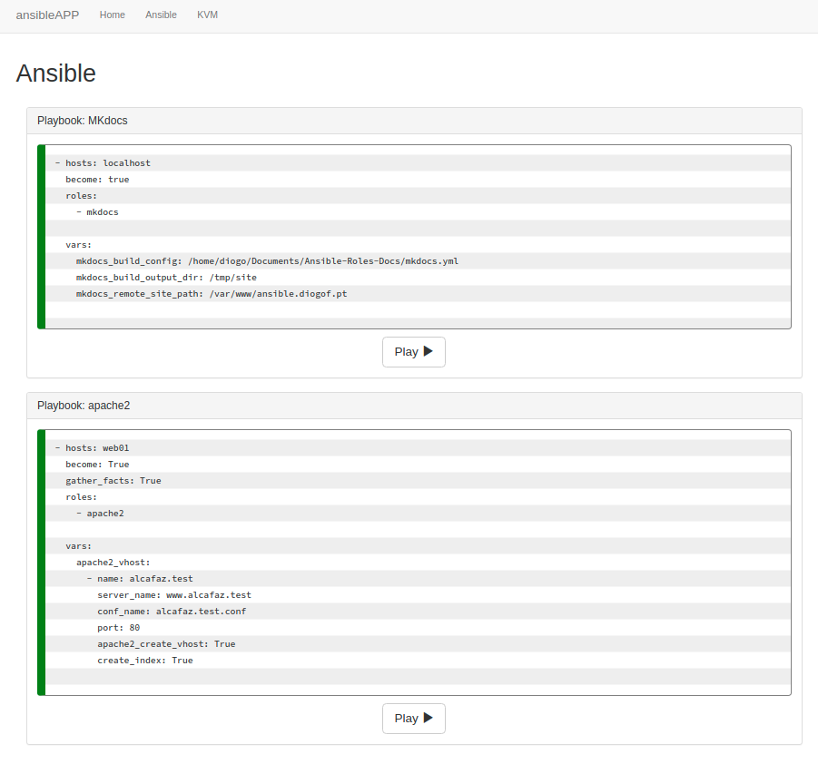
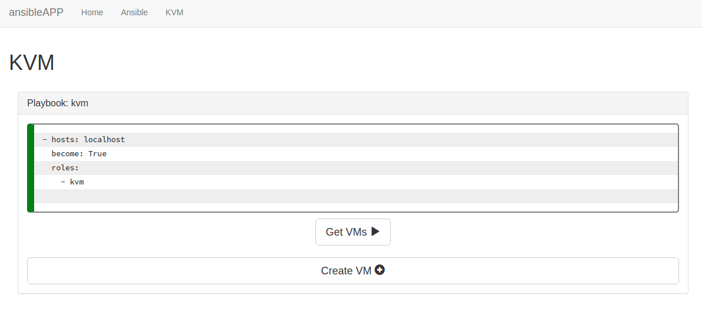
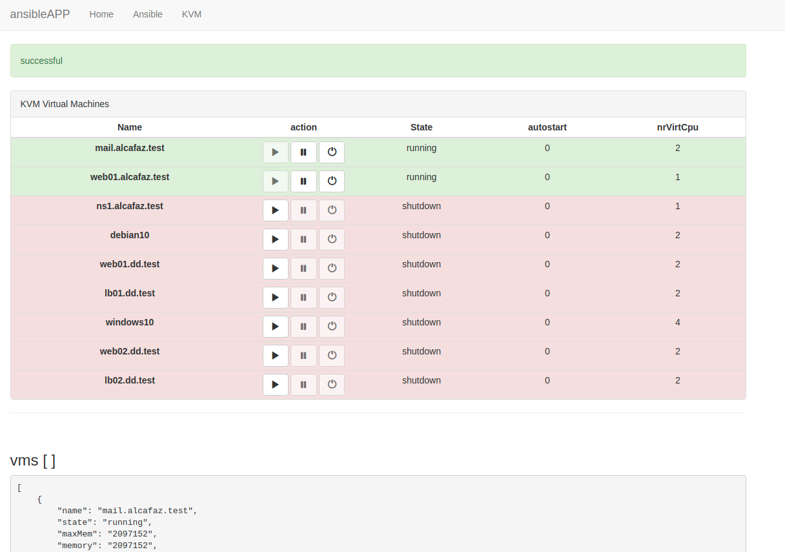
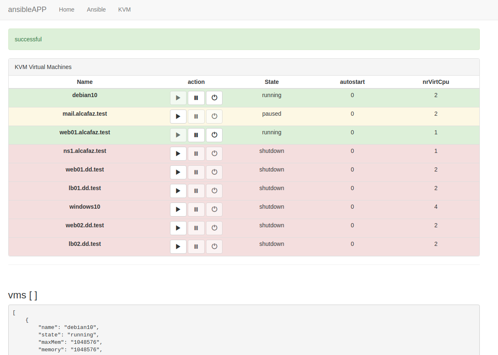
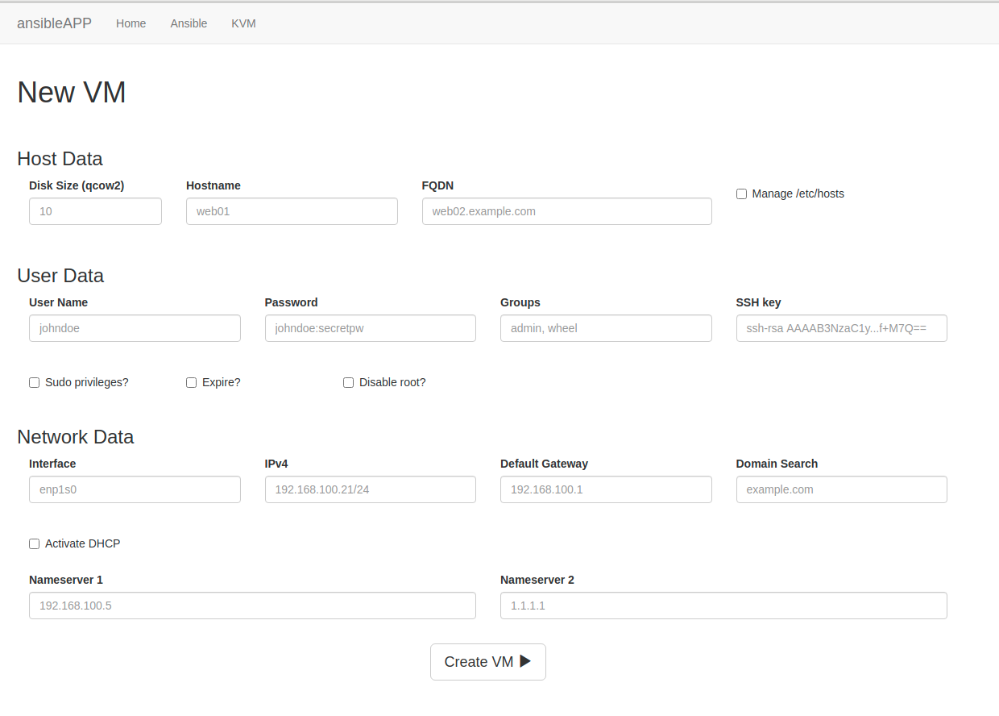

# ansibleAPP

Utilização do ansible-runner, como um módulo python, para interagir com o ansible (p. ex: executar um playbook)

## Playbooks:

+ 12.simple-apache2.yml
+ 11.push-mkdocs-to-remote.yml

## Listar máquinas virtuais

## Modificar o estado da vm (start, pause, unpause, shutdown)

## Criar uma nova máquina virtual (cloud-init)

